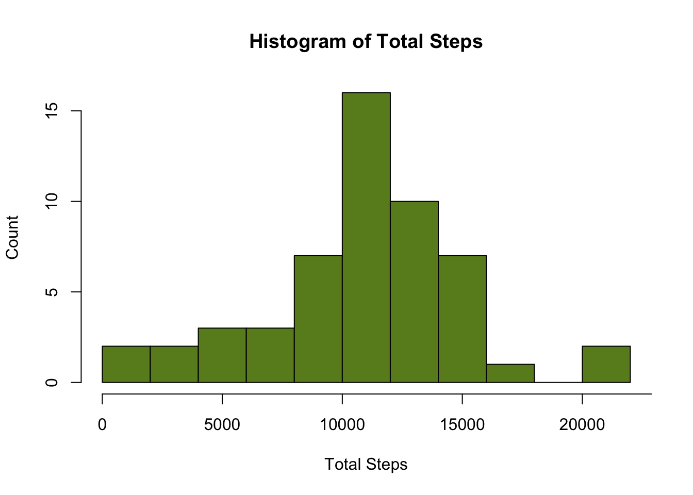
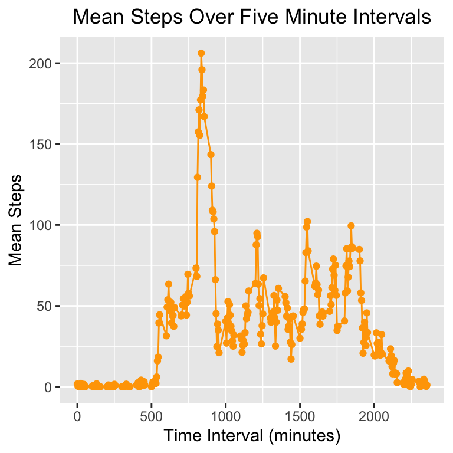
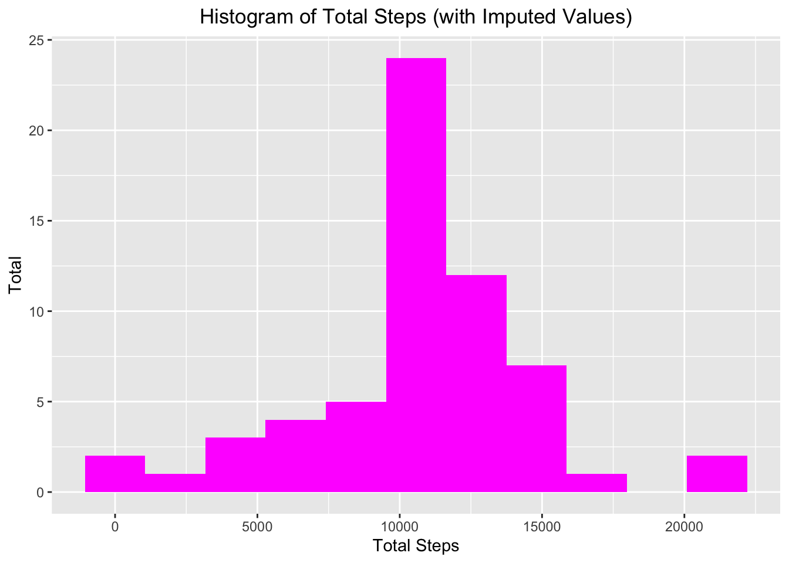
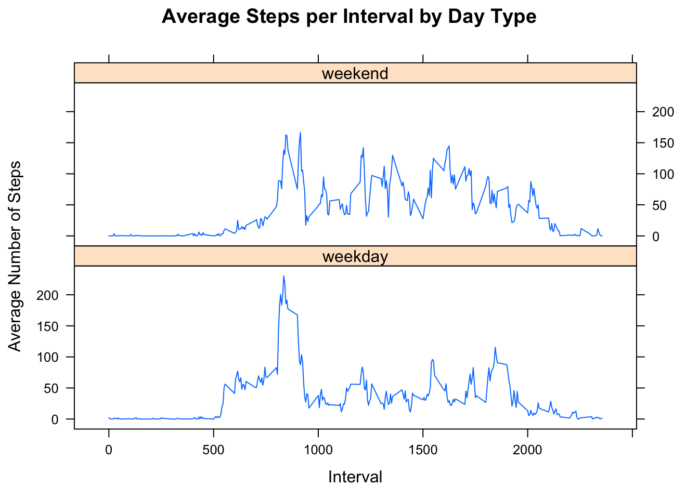

setwd("/Users/saizac/Documents/Coursera_R/Module_5/RepData_PeerAssessment1")

## Loading and preprocessing the data

```r
unzip("activity.csv")
```

```
## Warning in unzip("activity.csv"): error 1 in extracting from zip file
```

```r
activities <- read.csv("activity.csv", header = TRUE, stringsAsFactors = FALSE)
activities$date <- as.Date(activities$date, format = "%Y-%m-%d")
cleaned <- activities[!is.na(activities$steps), ]
```
## What is mean total number of steps taken per day?
#Calculate the total number of steps taken per day.

```r
library(dplyr)
```

```
## 
## Attaching package: 'dplyr'
```

```
## The following objects are masked from 'package:stats':
## 
##     filter, lag
```

```
## The following objects are masked from 'package:base':
## 
##     intersect, setdiff, setequal, union
```

```r
sumsteps <- cleaned %>% group_by(date) %>% summarize(total_steps = sum(steps))
```

```
## `summarise()` ungrouping output (override with `.groups` argument)
```
#Make a histogram of total number of steps taken per day

```r
hist(sumsteps$total_steps,breaks = 10, freq = TRUE,
     main = "Histogram of Total Steps", xlab = "Total Steps", ylab = "Count",
     col = "olivedrab4", xaxt = "n")
axis(1, at = seq(0,25000,5000))
```

<!-- -->
#Compute the median and mean of the total number of steps.

```r
mean <- mean(sumsteps$total_steps)
median <- median(sumsteps$total_steps)
```
The mean total number of steps taken is 1.0766189\times 10^{4}.  The median number of steps
taken is 10765. 

## What is the average daily activity pattern?

```r
act <- activities[complete.cases(activities), ]
stepsint <- act %>% group_by(interval) %>% summarize(mean_steps = mean(steps, na.rm = TRUE))
```

```
## `summarise()` ungrouping output (override with `.groups` argument)
```

```r
library(ggplot2)
p <- ggplot(stepsint, aes(x=interval, y=mean_steps)) +
    geom_line(color="orange") + 
    geom_point(col = "orange") +
    labs(x = "Time Interval (minutes)", y = "Mean Steps",
         title = "Mean Steps Over Five Minute Intervals") +
    theme(plot.title = element_text(hjust = 0.5))
print(p)
```

<!-- -->
#Which interval has the maximum average number of steps?

```r
max <- filter(stepsint, mean_steps == max(mean_steps))
max[,1]
```

```
## # A tibble: 1 x 1
##   interval
##      <int>
## 1      835
```

## Imputing missing values
#Calculate the number of missing values

```r
na <- activities[!complete.cases(activities), ]
nrow(na)
```

```
## [1] 2304
```
#Impute missing values

```r
index <- numeric(nrow(activities))
for(i in 1:nrow(activities)) {
        if(is.na(activities[i, "steps"]) == TRUE)
        {
            index[i] <- filter(stepsint, interval == activities[i, "interval"]) %>% select(mean_steps)
        }
        else{
            index[i] <- activities[i, "steps"]
        }
}

activity_without_NAs<-mutate(activities,steps_no_NAs = index)
```
We are checking here if we preserved the original values (the ones that were not NAs)

```r
check <- filter(activity_without_NAs,!is.na(steps)) %>% mutate(ok = (steps==steps_no_NAs))
checkmean <- mean(check$ok)
#The mean should be 1 if all of the values match.
imputeddf <- select(activity_without_NAs, 2:4) #selecting the interval,
#date, and new steps columns (with the imputed values)
imputeddf$steps_no_NAs <- as.numeric(imputeddf$steps_no_NAs)
```
A mean of 1 indicates that all original steps values were preserved.  
The mean is 1.

#Make a histogram of the total number of steps taken each day.

```r
perday <- imputeddf %>% group_by(date) %>% summarize(total = sum(steps_no_NAs))
```

```
## `summarise()` ungrouping output (override with `.groups` argument)
```

```r
binwidth <- (max(perday$total) - min(perday$total))/10
p2 <- ggplot(perday, aes(x=total)) +
        geom_histogram(binwidth = binwidth, fill = "magenta") +
        labs(x = "Total Steps", y = "Total", 
             title = "Histogram of Total Steps (with Imputed Values)") +
        theme(plot.title = element_text(hjust = 0.5))
print(p2)
```

<!-- -->

```r
mean2 <- mean(perday$total)
median2 <- median(perday$total)
```
Mean (not imputed): 1.0766189\times 10^{4}
Mean (imputed): 1.0766189\times 10^{4}
Median(not imputed): 10765
Median (imputed): 1.0766189\times 10^{4}

The mean remained the same, but the median increased from the first to the
second dataset after imputing values.

## Are there differences in activity patterns between weekdays and weekends?

```r
imputeddf$weekday <- weekdays(imputeddf$date)
weekdays <- c("Monday", "Tuesday", "Wednesday", "Thursday", "Friday")
weekends <- c("Saturday", "Sunday")
for (i in 1:nrow(imputeddf)) {
    if(imputeddf[i, "weekday"] %in% weekdays) {
        imputeddf[i, "DayType"] <- c("weekday")
    }
    else{imputeddf[i, "DayType"] <- c("weekend")
    }
}
imputeddf$DayType <- factor(imputeddf$DayType)
```


```r
#averaging steps across weekday/weekend for each interval
finaldf <- imputeddf %>% group_by(interval, DayType) %>% 
    summarize(mean_steps = mean(steps_no_NAs))
```

```
## `summarise()` regrouping output by 'interval' (override with `.groups` argument)
```

```r
library(lattice)
xyplot(mean_steps ~ interval | DayType, data = finaldf, type = "l", 
       layout = c(1,2), main = "Average Steps per Interval by Day Type",
       ylab = "Average Number of Steps", xlab = "Interval")
```

<!-- -->
